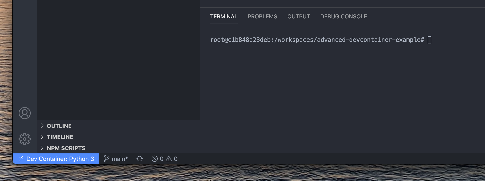
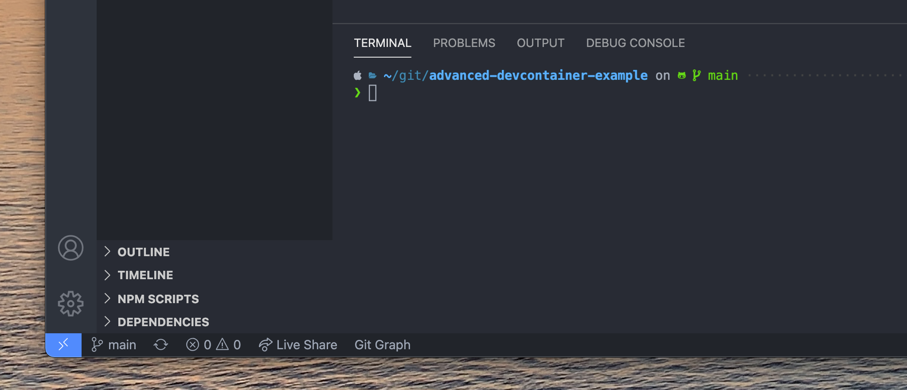
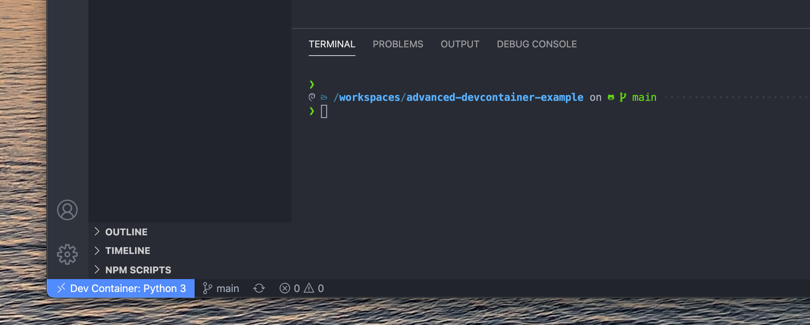

## Intro

Visual Studio Code is currently one of the most popular editors out there. One
of my favourtie features that I anecdotally feel doesn't get the light it
deserves is [remote
extension](https://code.visualstudio.com/docs/remote/remote-overview),
specifically it's use for development containers.

The remote extension effectively allows you to do all the things you would
normally in VS Code on your host on a server, in
[WSL](https://docs.microsoft.com/en-us/windows/wsl/), or in this case in a
docker container. Since we can operate VS Code in a Docker container like we
would on our host, this enables us to dockerize our development environment.

A few of the reasons I'm very much in favour of dockerizing the dev environment
are:
- **Development is off the host**: Accidently mess something up in your
  development environment? Just re-build the container and your good to go.
- **Instant setup for new users**: Chances are you have worked on a project with
  a long `README.md` on installing frameworks and all the dependencies for it.
  These can often be complicated, especially for junior developers or developers
  who are new to the ecosytem. With dev containers, new users can get setup and
  ready to go by simply opening the repository in VS Code.
- **Writing a `Dockerfile` for your dev environment is forced documentation**:
  When you write a `Dockerfile` on your dev environment, your recording
  everything you need to do to get your environment setup. This potentially
  saves the "setup" section in your `README.md`, and can help new users with
  getting up to speed on the project.
- **Instant setup for new projects**: VS Code has a huge library already of
  commonly used dev container configurations; You don't need to build yours from
  scratch. All you need to do to get started is tell VS Code you want to create
  a development environment and it will walk you through which services you want
  to create. 


## Porting shell config over

**_Note: You can find a working example with the code below at [this GitHub
repo](https://github.com/mclean25/advanced-devcontainer-example)_**

Another great feature of VS Code is its integrated terminal. One of the things
I didn't like when using dev containers is that you lose access to your hosts
integrated terminal (as you're using the terminal in the dev container). What I
wanted to do was have my shell and it's plugins ported over to the dev container
so that it looks and acts similarily to how it does on my host:

##### Default VS Code terminal shell (in dev container)


##### Zsh shell used on local MacOS


##### End result with ported shell config


## Getting Started

In order to get our configuration over into the dev container, we need to:
1. Install the shell of preference (I'm doing zsh here) into the container
2. Copy over any configuration files we want into the container so that
the shell (zsh) installation in the container can use them.

In order to do this, we're going to take use the `initializeCommand` and
`postCreateCommand` options in `devcontainer.json` in order to execute a few
things we want before and after the dev container is built.

Add the following to your `devcontainer.json` file:

###### ` .devcontainer/devcontainer.json`
```json
  //...
  "initializeCommand":
    "chmod +x ./.devcontainer/pre-build-script.sh && ./.devcontainer/pre-build-script.sh",
  "postCreateCommand":
    "chmod +x ./.devcontainer/post-build-script.sh && ./.devcontainer/post-build-script.sh",
  //...
```

What we're doing here is simply getting VS Code to execute a couple shell
scripts that we'll set up in the folder, to keep `devcontainer.json` cleaner
and more organized.

## Per User Configuration

One of the benefits of VS Code's dev containers is the ability to scale setting
up different environments for coworkers. This way, a coworker could come along
and instantly get setup with all of the necessary
programs/frameworks/dependencies installed and ready to go.

Since your coworkers or collaborators could be using different shells/frameworks
then you (eg: [fish](https://fishshell.com/)), you can create a configuration
file that will be ignored by source control and then edited locally for each
user's usecase.

###### `.devcontainer/config.example.sh`
```bash
#!/bin/bash

# Copy this file and save as `config.sh` within the `.devcontainer` directory.

temp_config_dir=.temp-config

# ------------------------
# Custom Settings
# ------------------------
# Add paths of files or directories relative to your $HOME folder in order to
# port them over to the dev container. Delimit paths by a single space.
# The placeholders here in this array are just examples and can be removed or
# edited.
# eg: paths_to_port=(.zshrc .p10k.zsh .oh-my-zsh)
paths_to_port=()

# Add commands to be run after the container has been built. The placeholders
# here can be removed or edited.
# eg: install_cmds() {
#    apt-get install zsh -y
# }
install_cmds() {
    # remove the 'true' no-op when you add your own
    true
}
```

## Pre-build Script
This script will run before VS Code builds your dev container. The following
script will copy any of the files you want to use in your dev container from
your host to the workspace directory, so that you can then access them once
the container is built. This needs to be done before the container is built
because only the workspace is ported over to the container once VS Code calls
Docker to build the container.

###### `.devcontainer/pre-build-script.sh`
```bash
#!/bin/bash

# shellcheck source=./.devcontainer/config.sh
source ./.devcontainer/config.sh

# Delete our temp directory if one already exists
if [ -d "./${temp_config_dir}" ]; then rm -Rf "./${temp_config_dir}"; fi
mkdir "./${temp_config_dir}"

"""
Moves a file or directory from the host to the workspace folder so that it
can be used by the dev container. This needs to be done since the root's
home directory is out of scope for the workspace, so desired files from outside
of the workspace scope need to be ported over before hand.

Args:
    $1: path of file or directory to move to the dev container's workspace
        dir.
"""
move_to_workspace()
{
    local path=$1

    full_path=~/$path

    echo "Copying ${full_path} to ./${temp_config_dir}/"

    if [ -d "${full_path}" ]
        then cp -aR "${full_path}" "./${temp_config_dir}/${path}" 
            \ || echo "error copying folder ${full_path}"
    elif [ -f "${full_path}" ]
        then cp "${full_path}" "./${temp_config_dir}/${path}" 
            \ || echo "error copying file ${full_path}"
    else echo "${full_path} is not valid";
        exit 1
    fi
}

for path in "${paths_to_port[@]}"
do
    move_to_workspace "${path}"
done
```

## Post-build Script
Now that the container is built, we want to move the files that were located in
our `$HOME` directory on our host to the `$HOME` directory on the container so
that our shells/frameworks can use them.

###### `.devcontainer/post-build-script.sh`
```bash
#!/bin/bash

source ./.devcontainer/config.sh || echo "No 'config.sh' file found"; exit 1

WORKSPACE_TEMP_CONFIG_DIR=${PWD}/.temp-config
HOME_DIR=/root


"""
Moves a file or directory from the workspace dir to the home folder.
"""

move_to_home()
{
    local path=$1

    echo "${path}"

    full_path="${WORKSPACE_TEMP_CONFIG_DIR}"/"${path}"

    if [ -d "${full_path}" ]
        then cp -aR "${full_path}" "${HOME_DIR}"/"${path}" 
            \ || echo "error copying file ${full_path}"
    elif [ -f "${full_path}" ]
        then cp "${full_path}" "${HOME_DIR}"/"${path}" 
            \ || echo "error copying folder ${full_path}"
    else echo "\"${full_path}\" is not valid";
        exit 1
    fi
}

for path in "${paths_to_port[@]}"
do
    echo "Moving path \"{$path}\""
    move_to_home "${path}"
done

rm -r "${WORKSPACE_TEMP_CONFIG_DIR}"

# execute install commands
install_cmds
```

## Result

Using these files, when I rebuild the dev container I now have a zsh shell with
my oh-my-zsh plugins set just as they are on my host. You may need to initiate
the shell (eg: typing `zsh`), or your can set the
`"terminal.integrated.shell.linux"` property in `"setting"` in
`devcontainer.json`. For example, I have mine set to `"zsh"`.


